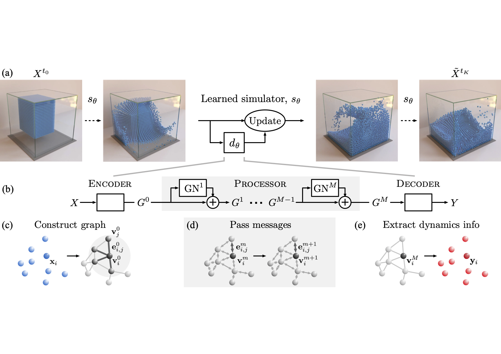

# [Learning to Simulate Complex Physics with Graph Networks](https://arxiv.org/abs/2002.09405)
Authors: Alvaro Sanchez-Gonzalez, Jonathan Godwin, Tobias Pfaff, Rex Ying, Jure Leskovec, Peter W. Battaglia, ICML 2020.  
Presenters: **Yuanhao Xiong**, **Xiangning Chen**, **Li-Cheng Lan**  
Codes: (https://github.com/deepmind/deepmind-research/tree/master/learning_to_simulate)  
Video site: (https://sites.google.com/corp/view/learning-to-simulate)

## Introduction
Realistic simulators of complex physics are invaluable to many scientific and engineering disciplines. However, building a high-quality simulator is faced with significant difficulties, such as substantial computational resources, lack of knowledge of underlying physics and parameters, and the like. An attractive alternative to traditional simulators is to use machine learning to train simulators directly from observed data. In this paper, a powerful machine learning framework forlearning to simulate complex systems from data — “GraphNetwork-based Simulators” (GNS) is presented. Experiments have shown that GNS can learn to accurately simulate a wide range of physical systems, generalized well to much larger systems and longer time scales than those on which it was trained.

## Related works
This paper focus on particle-based simulation, where states are represented as a set of particles that encode mass, material, movement, etc. within local regions of space. Dynamics are computed on the basis of particles’ interactions within their local neighborhoods. Besides, recently graph networks have proven effective at learning forward dynamics in various settings that involve interactions between many entities. For example, interaction networks. And there are two baseline methods mentioned in this paper, DPI and CConv. They are both designed for specific settings and authors made a comparison in the experiments.

## Method

## Experimental Results

## Major Conclusions
- IN shows strong ability to learn accurate physical simulations and can automatically generalize their training to novel contexts.
- It can roll out thousands of realistic future state predictions, even when trained only on single-step predictions.
- IN present the first general-purpose learnable physics engine that can scale up to real-world problems.
- IN provides a powerful general framework for reasoning about object and relations in complex real-world domains.

## Pros and Cons
- Pros
    - First general-purpose physical engine
    - Generalize their training to novel systems with different numbers and configurations of objects and relations
    - Could also learn to infer abstract properties of physical systems, such as potential energy
- Cons
    - If to handle very large systems with many interactions, then we need to reduce computation through methods like culling interaction computations with negligible effects
    - Only support binary relation
        - How to extend it to n-th order relations by combining n senders in each bk.
        - The interactions could even have variable order, where each bk includes all sender objects that interact with a receiver, but would require a f_R than can handle variable-length inputs.
    - Take the graph as input
        - Objects and relations are known
        - Prepend a perceptual front-end that can infer the graph from raw observations

