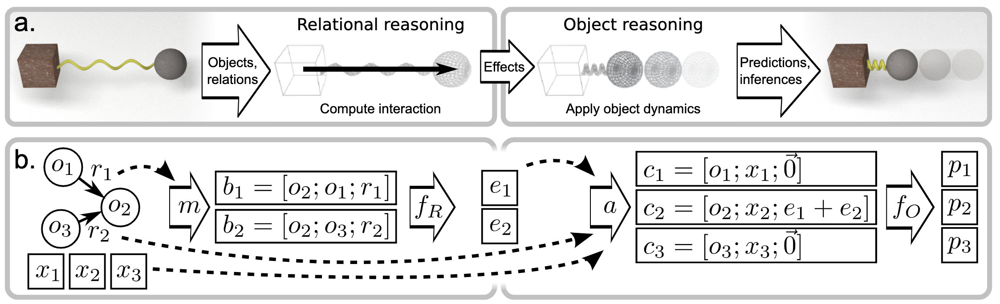

# [Interaction Networks for Learning about Objects,Relations and Physics](https://arxiv.org/abs/1612.00222)
Authors: Peter W. Battaglia, Razvan Pascanu, Matthew Lai, Danilo Rezende, Koray Kavukcuoglu, NIPS 2016.  
Presenters: **Shuwen Qiu**, **Jiayue Sun (jysun@cs.ucla.edu)**, **Qing Li (dylan.liqing@gmail.com)**

## Introduction
Representing and reasoning about objects, relations, and physics is a “core” domain of human common sense knowledge. Many everyday problems like predicting what will happen next in physical environments and inferring underlying properties of complex scenes are challenging to models, while people can nevertheless solve such problems by decomposing the scenario into distinct objects and relations, and reasoning about the consequences of their interactions and dynamics. In this paper, the authors propose Interaction Network that can reason about objects and relations in complex systems. It takes advantage of three powerful approaches: structured models, simulation, and deep learning. Experimental results show that the model can predict future states of a complex system and abstract physical properties such as energy. It can also be generalized to novel systems with different numbers and configurations of elements.

## Related works
The behavior of Interaction Network is similar in spirit to a physical simulation engine(D Baraff, 2001). The engine will generate sequences of states by repeatedly applying rules that approximate the effects of physical interactions and dynamics on objects over time
the interaction rules are relation-centric, operating on two or more objects that are interacting
the dynamics rules are object-centric, operating on individual objects and the aggregated effects of the interactions they participate in.

Previous AI work on physical reasoning includes “NeuroAnimator” (R Grzeszczuk et al., 1998), training neural networks to predict and control the state of articulated bodies. Ladický et al. (2015) used regression forests to learn fluid dynamics. More recently, convolutional neural networks (CNNs) are used to predict and control a moving ball from an image centered at its coordinates(K Fragkiadaki et al. 2016) and the 3D trajectory of an object after an external impulse is applied(R Mottaghi et al. 2016). Interaction Network is the first model offered as a general-purpose learnable physics engine

## Method

This paper introduces the *Interaction Networks* (IN), which can reason how objects in complex systems interact, supporting dynamic prediction and inference about the systems' abstract properties. 

Take physical reasoning as an example. An interaction network takes objects and relations as input, reasons about their interactions, and applies the effects and physical dynamics to predict new states. Assuming two objects and one directed relationship, the first (sender) influences the second (receiver) via their interaction. This interaction's effect can be predicted by a relation-centric function, which takes as input the two objects and attributes of their relationship. The object-centric function takes as input the interaction and the current state of an object to predict its future state. 

The above formulation can be expanded to larger and more complex systems by representing them as a graph, where the nodes correspond to the objects and the edges to the relations. The model rearranges the objects and relations into interaction terms by a marshaling function and computes their effects via a relational model. The effects are then aggregated and combined by an aggregation function with the objects and external effects to generate input for an object model, predicting how the interactions and dynamics influence the objects. This basic IN can predict the evolution of states in a dynamical system; for example, in physical simulation, the final output may represent the objects' future states. The IN can also be augmented with an additional aggregation model to predict global properties, such as energies, for the whole system. 

## Experimental Results
The experiments are conducted on three domains: n-body problem, balls bouncing in a box and n-mass string. And IN is evaluated on two prediction tasks: 1) predict velocity at the next time step, 2) estimate potential energy at the current time step. And it is compared with three other models: 1) constant velocity model that outputs the input velocity, 2) baseline MLP model that takes the flattened input data, 3) dynamics-only IN that eliminates the relation model.

As for the next-step velocity prediction task, IN showcases orders of lower MSE test error compared to other baseline models. And it also generalizes well to systems with fewer and greater number of objects. The model trained on systems with larger number of objects also perform better than models trained on less complex system.

As for the abstract value estimation task (potential energy), IN is also much accurate in potential energy prediction than all other baselines. It presumably learns the gravitational and spring potential energy functions, applies them to the relations ihe domain, and combines the energy estimation results.

## Major Conclusions
- IN shows strong ability to learn accurate physical simulations and can automatically generalize their training to novel contexts.
- It can roll out thousands of realistic future state predictions, even when trained only on single-step predictions.
- IN present the first general-purpose learnable physics engine that can scale up to real-world problems.
- IN provides a powerful general framework for reasoning about object and relations in complex real-world domains.

## Pros and Cons

