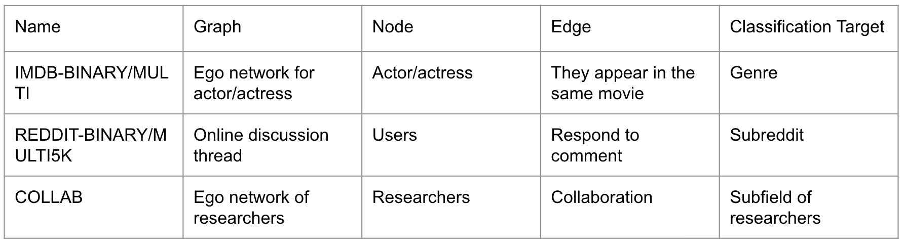
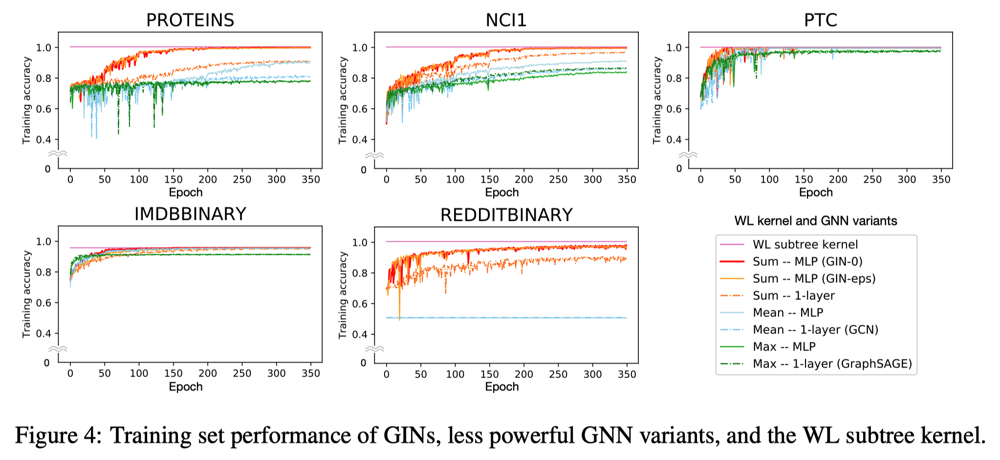
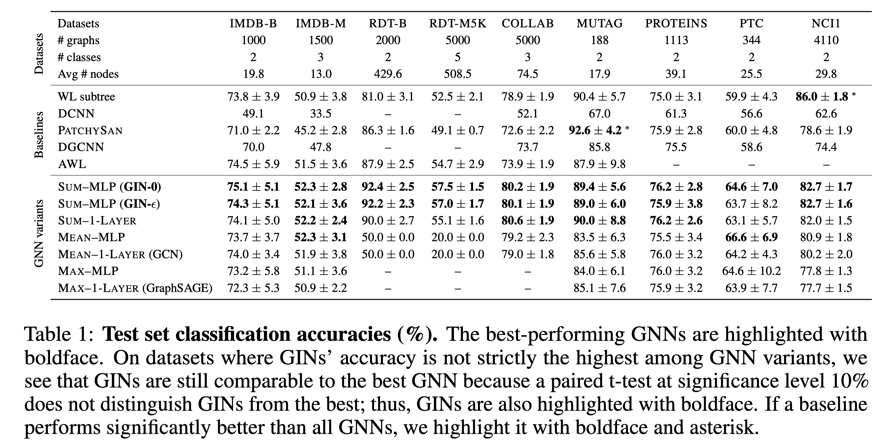

# How Powerful are Graph Neural Networks?

## Motivation

The design of new GNNs is mostly based on empirical intuition, heuristics, and experimental trial-and-error. There is little theoretical understanding of the properties and limitations of GNNs, and formal analysis of GNNs’ representational capacity is limited.

## Contributions and Results
* GNNs are __at most__ as powerful as the WL test in distinguishing graph structures.
* Established conditions on the neighbor aggregation and graph pooling functions under which the resulting GNN is __as powerful__ as the WL test.
* Identified graph structures that cannot be distinguished by popular GNN variants, such as GCN and GraphSAGE and characterized the kinds of graph structures such GNN-based models can capture. 
* Developed a simple neural architecture, **Graph Isomorphism Network (GIN)** and showed that its discriminative/representational power is equal to the power of the WL test.

## Preliminaries

### Graph Neural Networks

Modern GNNs follow a neighborhood aggregation strategy, where we iteratively update the representation of a node by aggregating representations of its neighbors. After k iterations of aggregation, a node’s representation captures the structural information within its k-hop network neighborhood.

### Weisfeiler-Lehman (WL) test

The graph isomorphism problem asks whether two graphs are topologically identical. 

Apart from some corner cases, the **Weisfeiler-Lehman (WL) test of graph isomorphism** (Weisfeiler & Lehman, 1968) is an effective and computationally efficient test that distinguishes a broad class of graphs. Its 1-dimensional form, “naïve vertex refinement”, is analogous to neighbor aggregation in GNNs. The WL test iteratively (1) aggregates the labels of nodes and their neighborhoods, and (2) hashes the aggregated labels into unique new labels. The algorithm decides that two graphs are non-isomorphic if at some iteration the labels of the nodes between the two graphs differ.

Based on the WL test, Shervashidze et al. (2011) proposed the **WL subtree kernel** that measures the similarity between graphs. 

## An Overview

Feature vectors of a set of neighboring nodes form a **multiset**: the same element can appear multiple times since different nodes can have identical feature vectors. A maximally powerful GNN would never map two different neighborhoods, i.e., multisets of feature vectors, to the same representation. This means its
aggregation scheme must be **injective**. 

## Maximum Representational Capacity of GNN-based Models

Any aggregation-based GNN is __at most__ as powerful as the WL test in distinguishing different graphs. 

If the neighbor aggregation and graph-level readout functions are injective, then the resulting GNN is __as powerful as__ the WL test.

## Experimental Results

**Dataset**

The target task is graph classification. Datasets are from two domains:
* 4 bioinformatics datasets: MUTAG, PTC, NCI1, PROTEINS
* 5 social network datasets
  

**Training Set Performance**

Higher accuracy in training set refect better representational power for GNNs. 

Main results:
* GINs are able to almost perfectly fit all the training sets
* Explicit learning of  yields no gain compared to fixing  to 0
* GNNs with MLPs are better than GNNs with 1 layer perceptrons
* GNNs with sum aggregators are better than GNNs with mean/max pooling aggregators
* WL subtree kernel is the method with the ceiling performance across all methods

**Testing Set Performance**

The better accuracy on test set reflects better generalization capacity and demonstrates stronger expressive power. Main results:
* GIN-0 is the best or very close to the best on all 9 datasets
* GIN-0 is better than GIN- due to its simplicity
* Mean-based GNNs perform much worse than sum-based GNNs

## Pros and Cons

