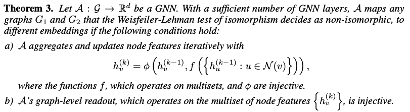
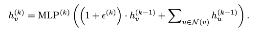
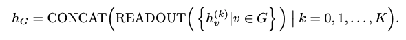
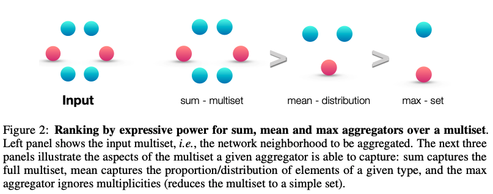
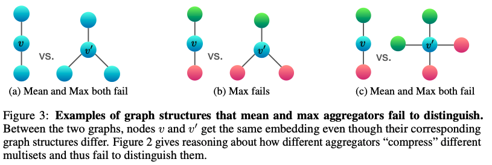

# How Powerful are Graph Neural Networks?

## Motivation

The design of new GNNs is mostly based on empirical intuition, heuristics, and experimental trial-and-error. There is little theoretical understanding of the properties and limitations of GNNs, and formal analysis of GNNs’ representational capacity is limited.

## Contributions and Results
* GNNs are __at most__ as powerful as the WL test in distinguishing graph structures.
* Established conditions on the neighbor aggregation and graph pooling functions under which the resulting GNN is __as powerful__ as the WL test.
* Identified graph structures that cannot be distinguished by popular GNN variants, such as GCN and GraphSAGE and characterized the kinds of graph structures such GNN-based models can capture. 
* Developed a simple neural architecture, **Graph Isomorphism Network (GIN)** and showed that its discriminative/representational power is equal to the power of the WL test.

## Preliminaries

### Graph Neural Networks

Modern GNNs follow a neighborhood aggregation strategy, where we iteratively update the representation of a node by aggregating representations of its neighbors. After k iterations of aggregation, a node’s representation captures the structural information within its k-hop network neighborhood.

### Weisfeiler-Lehman (WL) test

The graph isomorphism problem asks whether two graphs are topologically identical. 

Apart from some corner cases, the **Weisfeiler-Lehman (WL) test of graph isomorphism** (Weisfeiler & Lehman, 1968) is an effective and computationally efficient test that distinguishes a broad class of graphs. Its 1-dimensional form, “naïve vertex refinement”, is analogous to neighbor aggregation in GNNs. The WL test iteratively (1) aggregates the labels of nodes and their neighborhoods, and (2) hashes the aggregated labels into unique new labels. The algorithm decides that two graphs are non-isomorphic if at some iteration the labels of the nodes between the two graphs differ.

Based on the WL test, Shervashidze et al. (2011) proposed the **WL subtree kernel** that measures the similarity between graphs. 

## An Overview

Feature vectors of a set of neighboring nodes form a **multiset**: the same element can appear multiple times since different nodes can have identical feature vectors. A maximally powerful GNN would never map two different neighborhoods, i.e., multisets of feature vectors, to the same representation. This means its
aggregation scheme must be **injective**. 

## Maximum Representational Capacity of GNN-based Models

Any aggregation-based GNN is __at most__ as powerful as the WL test in distinguishing different graphs. 

If the neighbor aggregation and graph-level readout functions are injective, then the resulting GNN is __as powerful as__ the WL test. The conditions for a maximal powerful GNN is then stated as 

To satisfy the conditions, the authors propose a simple architecture called GraphI somorphism Network (GIN) and considers countable node feature space only. Uncountable sets, where node features are continuous, need some further considerations and are left for future work.

### GraphI somorphism Network (GIN)

The scheme for GIN is demonstated as:

And the injectiveness of the sum aggregator and the combine function is proven with Lemma 5 and Corollary 6 (see more on the slides and paper appendix).

For graph classification, the additional structure for GIN is demonstrated as:

* CONCAT: to consider all structural information, we use information from all depths/iterations of the model.
* READOUT: by Theorem 3 and Corollary 6, GIN can replace READOUT with summing all node features from the same iterations.

## Ablation Studies

### 1-Layer perceptrons are not sufficient

Instead of MLPs, 1-layer perceptrons can behave much like linear mappings, so the GNN layers degenerate into simply summing over neighborhood features. Therefore, there could exist input multisets that are different but sum to the same value, and would result in the same output for any 1-layer perceptron. Note that with the bias term and sufficiently large output dimensionality, 1-layer perceptrons might be able to distinguish different multisets. However, it is still not a universal approximator of multiset functions.

### Structures that confuse mean and max-pooling

The ranking by expressive power of mean and max-pooling as compared to sum is shown below. We note that mean and max-pooling are not injective aggregators for multisets, and are therefore less expressive than sum.

And the structures that would confuse mean or max-pooling is shown below, where same color refers to the same node.

Basically, mean learns the distribution/proportion of the multiset and fails to distinguish multisets that are of the same proportions but different sizes. Max-pooling leans the sets with distinct elements and fails to distinguish multisets that have the same set of unique nodes but different number of them.

## Experimental Results

**Dataset**

The target task is graph classification. Datasets are from two domains:
* 4 bioinformatics datasets: MUTAG, PTC, NCI1, PROTEINS
* 5 social network datasets
  

**Training Set Performance**

Higher accuracy in training set refect better representational power for GNNs. 

Main results:
* GINs are able to almost perfectly fit all the training sets
* Explicit learning of  yields no gain compared to fixing  to 0
* GNNs with MLPs are better than GNNs with 1 layer perceptrons
* GNNs with sum aggregators are better than GNNs with mean/max pooling aggregators
* WL subtree kernel is the method with the ceiling performance across all methods

**Testing Set Performance**

The better accuracy on test set reflects better generalization capacity and demonstrates stronger expressive power. Main results:
* GIN-0 is the best or very close to the best on all 9 datasets
* GIN-0 is better than GIN- due to its simplicity
* Mean-based GNNs perform much worse than sum-based GNNs

## Pros and Cons

Pros
* Developed theoretical foundations for reasoning about the expressive power of GNNs
* Designed provably maximally powerful GNN under neighborhood aggregation framework

Cons
* Beyond neighborhood aggregation framework?
* Discriminative power is not the only thing about representation power, most applications are not doing graph isomorphism tests

Not sure
* The main assumption is the input node features are from a countable universe. But do real-world graph classification applications’ input node features come from a countable universe?
