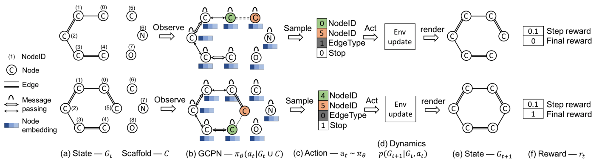

# [Graph Convolutional Policy Network for Goal-Directed Molecular Graph Generation](https://arxiv.org/pdf/1806.02473.pdf)
Authors: Jiaxuan You, Bowen Liu, Rex Ying, Vijay Pande, Jure Leskovec, NeurIPS 2018.
Presenters: **Howard Xie**, **Shanxiu He**, **Justin Yi**  
Code: (https://github.com/bowenliu16/rl_graph_generation)  

## Introduction
Many important problems in drug discovery and material science are based on the principle of designing molecular structures with specific desired properties. However, this remains a challenging task due to the large size of chemical space (drug-like molecules has been estimated to be between $10^{23}$ and $10^{60}$). Additionally, chemical space is discrete, and molecular properties are highly sensitive to small changes in the molecular structure. An increase in the effectiveness of the design of new molecules with application-driven goals would significantly accelerate developments in novel medicines and materials. This paper presents Graph Convolutional Policy Network (GCPN), a molecule generation approach that takes into account specified desired objectives within the constraints of governing chemical principles.

## Related works
There are many existing works referenced by the paper some of which are as follows:
- Recurrent neural network (RNN) simplified molecular-input line-entry system (SMILES) string generator using Monte Carlo (MC) tree search and policy gradient.
- Variational Autoencoder (VAE) framework, where molecules are represented as junction trees of small clusters of atoms.
- Sequential graph generation models able to specify target molecular properties.

## Method

- Graph Representation
    - Utilizes a GCN to compute node embeddings and a policy on which Markov Decision Process (MDP) is defined
- Reinforcement Learning (RL)
    - Agent acts on an iterative graph generation process taking the intermediate generated graph as the state and chemical bonds to different atoms as the action space, governed by universal chemical principles via domain specific reward design.
- Adversarial Training
    - Employs a Generative Adversarial Network (GAN) framework to define adversarial rewards to ensure generated molecules resemble expert samples. 
    
 #### GCPN Details
- The model takes in current graph and scaffold subgraphs as inputs and predicts the possible actions (i.e. where to put links). 
- The generation process includes generating node embedding from GCN and generating probability distributions of possible nodes and edges for the next step.
- GCPN is trained via policy gradient to optimize a reward composed of molecular property objectives and adversarial loss. The adversarial loss is provided by a graph convolutional network based discriminator trained jointly on a dataset of example molecules.

## Experimental Results
Experiments are conducted on three different subdomains: 
1. Property Optimization
2. Property Targeting
3. Constrained Property Optimization

subject to different domain specific criteria:
- octanol-water partition coefficient ($logP$ score)
    - Penalized $logP$ accounts for ring size (strain) and synthetic accessibility
- druglikeness (QED)
- target range Molecular Weight (MW)

1. Property Optimization
    - GCPN performs significantly better than previous methods on this task and also outperforms in QED optimization
2. Property Targeting
    - Significantly higher success rate in generating molecules with properties in the target range.
3. Constrained Property Optimization
    - Outperforms baseline methods and generalizes well, applying a learned general policy to many molecules.

## Conclusions
GCPN is a graph generation policy network utilizing graph state representation and adversarial training. GCPN outperforms other SOTA in molecular property optimization while maintaining resemblence to realistic molecules.

## Pros and Cons
- Pros
    - This framework can be modified to be applied toward other graph generation tasks by establishing other domain specific reward designs
    - Generalizable to many types of molecules, given a modular set of governing principles 

- Cons
    - Long runtimes to generate graphs of large scale
    - Fails to address chemical compounds that stray from conventional principles in special cases
    - Provides no guarantees of synthesizability
